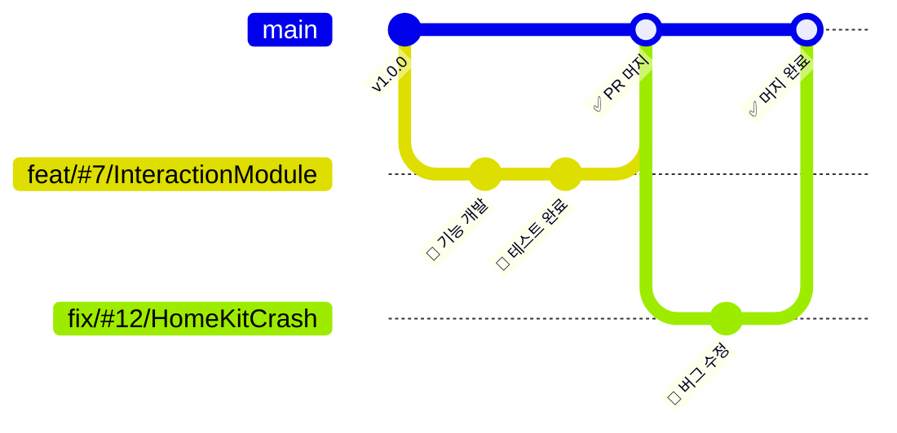

# 🧸 기꺼이 비주류 (ProudlyOffbeat) – 유일무이 HomeKit 기반 몰입형 동화 앱

   

> **"감각을 깨우는 동화, 기술로 이뤄낸 세계"**  
> 당연한 선택을 의심하며, 사용자가 머무르고 싶은 몰입의 공간을 설계합니다.

---

## 🏘️ 기꺼이 비주류 Team Member

| <a href="https://github.com/YooGyeongMo"> <b>Demian</b> @YooGyeongMo</a> | <a href="https://github.com/shinmingyu"> <b>Echo</b> @shinmingyu</a> | <a href="https://github.com/Jihan-Chae"> <b>Martin</b> @Jihan-Chae</a> | <a href="https://github.com/changjaemun"> <b>Ito</b> @changjaemun</a> |
|:--:|:--:|:--:|:--:|

## 🧩 About the Project

**“말보다 공간이 먼저 말을 거는 경험”** 우리는 아이들에게 읽히는 동화책이 아닌, 몸으로 느끼는 동화 세계를 주고 싶었습니다.

팀 기꺼이 비주류는 iPad로 동화를 펼치고,iPhone(매직 완드)를 이용한 인터렉션을 기반으로
iPad가 주변 기기(HomeKit)를 제어해 빛, 소리, 공간이 하나가 되는 몰입 환경을 만드는 유일무이한 감각 기반 동화 앱입니다.

아이들은 iPad 속에서 책장을 넘기며, 실제 방 안의 조명이 깜빡이고 바람 소리와 음악이 어우러진 진짜처럼 느껴지는 이야기 세계에 들어가게 됩니다.

🍎 iPad는 도서관처럼 장면을 고르고 SplitView로 책을 펼쳐줍니다. 
📱 iPhone은 장면별 인터랙션을 제어하고, 주변 장치를 컨트롤합니다. 
🏡 조명, 사운드, 연출은 HomeKit으로 공간에 바로 반영됩니다. 

>📘 자세한 기획 배경은 Notion 페이지에서 확인하실 수 있어요.
>👉 [Notion 보러가기](https://posacademy.notion.site/21d2b843d5af80c38a4ce477f0bf7eff?source=copy_link)

📘 [개발자 가이드 보러가기](./DEV.md)

---

## 📌 Features

📖 iPad Library
- 여러 장면 기반의 동화책을 SplitView로 구성 (선택 → 펼치기)
- 각 장면에 따라 HomeKit 장치 제어 (조명, 사운드, 기타 액터)

🎬 iPhone-based Interaction
- 각 장면에 따라 Multipeer Connectivity(P2P)로 연결된 iPad에게 시그널.

---

## ✨ 기술 스택 & 구조

| Stack        | 내용                                                                 |
|--------------|----------------------------------------------------------------------|
| **UI**       | SwiftUI + SwiftData (선언형 UI + 간결한 로컬 persistence)           |
| **아키텍처** | MVVM + Coordinator + Factory 기반 SOLID 설계                        |
| **모듈화**   | 내부 폴더 기반 모듈화 (기기별 Presentation, 공통 Interaction)        |
| **데이터**   | SwiftData 기반 Book/Scene/Interaction 모델 공유                      |
| **네트워크** | Multipeer Connectivity, HomeKit 기반 로컬 상호작용                   |

---

## 🛠️ UIKit vs SwiftUI 비교

| 항목               | UIKit (Imperative)                       | SwiftUI (Declarative)                        |
|--------------------|------------------------------------------|----------------------------------------------|
| **선언방식**       | 명령형                                  | 선언형                                       |
| **유지보수**       | 상태 & 이벤트 분리 어려움                | 상태 기반 바인딩 → 구조 간결                 |
| **러닝 커브**      | 팀원 대부분 미숙                         | 내부 학습 완료, 최신 기술에 적합              |
| **Agile 대응성**   | 구조 변경 시 비용 큼                     | 빠른 프로토타이핑, 반복 개발에 유리           |

✅ **SwiftUI 도입 이유**:  
- 내부 팀 SwiftUI & SwiftData 경험 → 빠른 실험 및 UI 구조 대응
- 명확한 상태 흐름과 바인딩 → 유지보수 용이

---

## 🧠 아키텍처 비교

| 항목             | MVC                      | MVP                         | MVVM (+ Coordinator)                        | TCA                                |
|------------------|---------------------------|------------------------------|---------------------------------------------|-------------------------------------|
| **View 책임**    | View + Controller 혼재     | View → Presenter 전달        | View → ViewModel 바인딩                     | View → Store (Reducer)              |
| **결합도**       | Controller-View 높음      | View-Presenter 1:1           | ViewModel 바인딩, 낮은 결합도               | View-Store 분리                     |
| **테스트 용이성**| ❌ 낮음                   | ⭕ Presenter 테스트 가능      | ⭕ ViewModel 테스트 용이                     | ⭕ Reducer 테스트 가능               |
| **SwiftUI 적합성**| ❌ UIKit에만 적합         | ❌ UIKit 기반                 | ⭕ SwiftUI 친화                              | ⭕ SwiftUI 최적화 구조               |
| **학습 난이도**  | 낮음                     | 중간                         | 중상 (SwiftUI에서 자주 사용)                | 상 (DSL 기반 복잡함)               |
| **Agile 대응성** | ❌ 영향도 큼              | 보통                         | ⭕ 유연한 모듈 분리, 반복 대응 가능          | ⭕ 일관된 상태 관리 가능            |

---

## ✅ 우리가 MVVM + Coordinator + Factory를 선택한 이유

### MVVM
- View ↔ ViewModel로 역할 분리 → SRP 충실
- 테스트 단위 명확화, 상태 관리 용이

### Coordinator
- 화면 흐름을 객체로 위임 → 네비게이션 로직 분리
- SwiftUI NavigationStack 중첩 문제 해소

### Factory
- View/ViewModel의 생성 책임 분리
- 화면 생성 흐름 통일 → 유지보수/DI 용이

> TCA는 매력적인 선택이지만, 초기 도입 시 러닝 커브와 DSL 부담으로 인해 제외하였습니다.

---

## 📦 모듈화 전략

| 전략                           | 설명                                                                 | 장점                                                           | 단점                                                       | 전환 이유                                                                 |
|--------------------------------|----------------------------------------------------------------------|----------------------------------------------------------------|------------------------------------------------------------|---------------------------------------------------------------------------|
| **멀티 타겟 (Multi Target)**     | 기기별 별도 타겟 구성                                               | - 각 기기 최적화 - 독립적 디버깅                                | - 설정 복잡 - 코드 중복 가능성 - 유지보수 어려움       | 공통 모듈이 많아 타겟 분리는 불필요하게 복잡하고 중복됨                     |
| **외부 프레임워크 모듈화**      | SPM/XCFramework를 통한 모듈 관리                                     | - 높은 재사용성 - 코드 독립성 - 분업 가능                   | - 초기 설정 복잡 - 빌드 느림 - 내부 변경 반영 지연     | 애자일하게 빠르게 변하는 구조에 맞지 않음 작은 팀에서 과한 분리 구조 |
| **내부 폴더 기반 모듈화 (선택)**| Presentation, Interaction 등으로 디렉터리 기준 기능 모듈 분리        | - 구성 단순 - 빠른 구조 변경 반영 - 빌드 빠름               | - 명시적 모듈 경계 부족 - 순환 참조 주의 필요              | SwiftUI + MVVM에 가장 자연스럽고 빠른 실험과 반복에 최적화             |

### ✅ 내부 폴더 기반 모듈화 선택한 이유

- **초기 유연한 설계 및 빠른 반영 주기**가 중요했기 때문에, 내부 폴더 기반 모듈화 채택
- SPM은 **재사용성과 프레임워크화**가 필요한 경우 적합하지만, 이번 프로젝트는 **기기 간 유기적 연결과 빠른 반복 개발**이 핵심
- `MVVM + Coordinator + Factory` 구조와 맞물려 **명확한 폴더링과 역할 분리**가 가능해짐

---

## 🧭 GitHub Flow 전략

- `main` → 기능 개발 통합 브랜치
- `feat/`, `fix/`, `refactor/`, `chore/` → 기능/수정/리팩토링/세팅 단위 브랜치
- PR 규칙: `feat/#7/InteractionModule` 등 이슈 기반 브랜치 이름 + 라벨링
